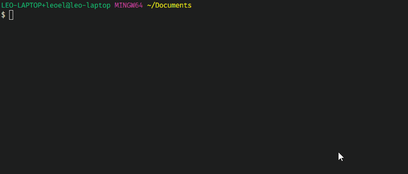
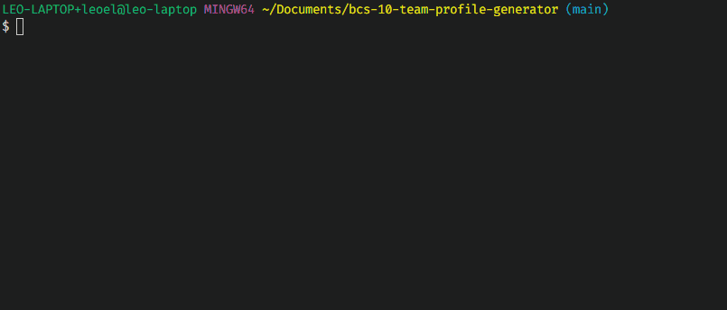

# Team Profile Generator

  

## Introduction

This CLI generates a Team Profile for you, using input from you in response to prompts about what you would like the README to contain.

The app is written in  and run with . It requires installation of `inquirer` and `chalk` packages through .

I made this app to learn about `OOP`, `classes` and after making it I learned about the importance of `modularization` and `extend`.

While making this app, I learned about the usefulness of constructors and methods, and linking `fs` read / write to generate HTML/CSS.

## Installation

| Step                                                                           | Command Line                                                           |
| ------------------------------------------------------------------------------ | ---------------------------------------------------------------------- |
| install [Node.js](https://nodejs.org/en/download/)                             | —                                                                      |
| clone from [GitHub](https://github.com/leoelicos/bcs-09-good-readme-generator) | `git clone https://github.com/leoelicos/bcs-10-team-profile-generator` |
| go inside the folder                                                           | `cd bcs-10-team-profile-generator`                                     |
| install dependencies                                                           | `npm i`                                                                |

_GIF of Install:_ [gifInstall](#gifInstall)

## Usage

| Step                         | Command Line                                                 |
| ---------------------------- | ------------------------------------------------------------ |
| run the generator            | `node index.js`                                              |
| answer the prompts           | `{answer}`                                                   |
| _cancel without generating_  | <kbd>Ctrl</kbd> + <kbd>C</kbd> / <kbd>⌘</kbd> + <kbd>C</kbd> |
| open /dist/ to see the files | `cd dist`                                                    |

_Video demo:_

https://user-images.githubusercontent.com/99461390/166132185-1cbab99f-736c-4d8d-9e05-e8811b2f411f.mp4

_or view on YouTube:_ [Demo On YouTube](https://youtu.be/lAuM7ytCxaU)

_Screenshot of Document:_ [generated](#generated)

_GIF of Usage:_ [gifRun](#gifRun)

## Testing

If you wish to run the tests you will need to install `jest`:

| Testing       | Command Line                  |
| ------------- | ----------------------------- |
| install jest  | `npm install --save-dev jest` |
| run the tests | `npm run test`                |

_GIF of Test:_ [gifTest](#gifTest)

## Screenshots

### gifInstall

_GIF of install:_

---

### gifRun

_GIF of run:_

---

### generated

_Example of the rendered product:_

---

### gifTest

_GIF of test:_

---

## Credits

### Documentation

-  BCS Resources

## License

&copy; Leo Wong <leoelicos@gmail.com>

Licensed under the [MIT License](./LICENSE).
